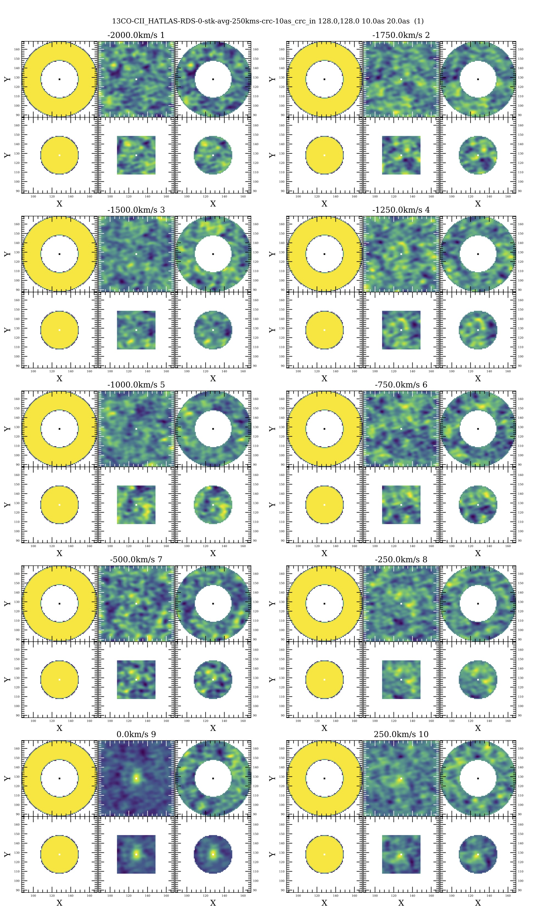
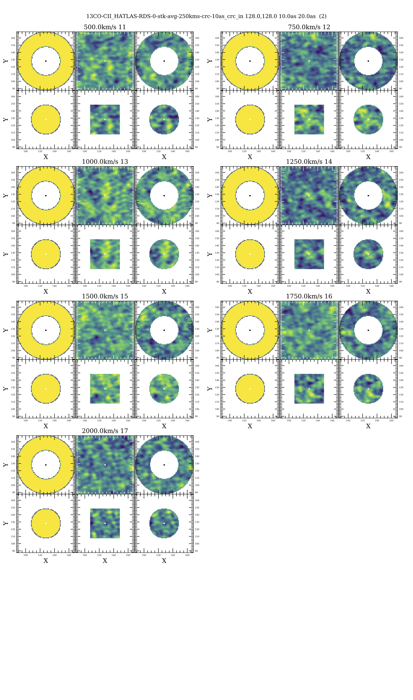
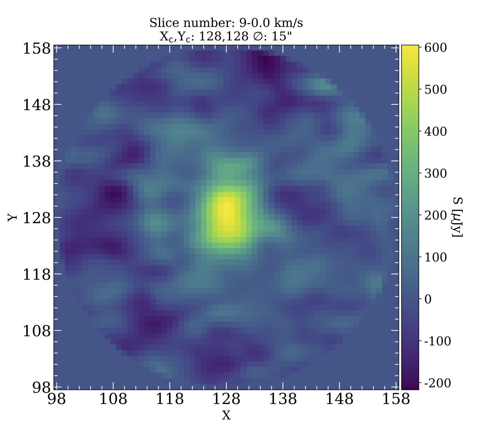
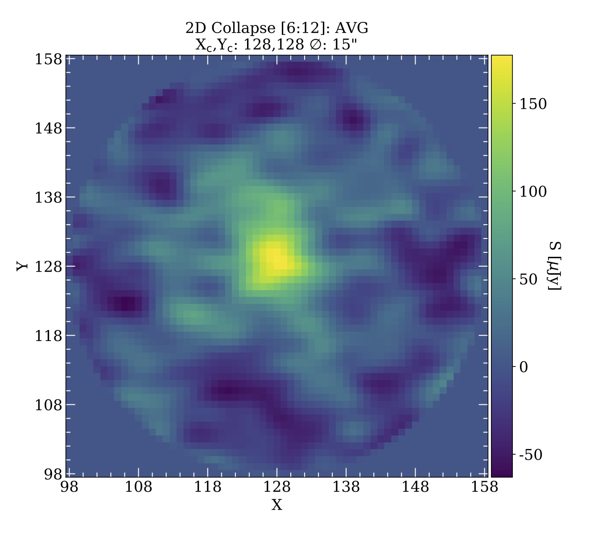

# VSAT-3D

VSAT-3D is part of the Valparaíso Stacking Analysis Tool (VSAT), it provide a series of tools for selecting, stacking, and analyzing 3D spectra. It is intended for stacking samples of datacubes belonging to large extragalactic catalogs by selecting subsamples of galaxies defined by their available properties (_e.g. redshift, stellar mass, star formation rate_) being possible to generate diverse (_e.g. median, average, weighted average, histogram_) composite spectra. However, it is possible to also use VSAT on smaller datasets containing any type of astronomical object.


## Content

1. Fnc_Stk_Dir.py:
   - Location of the input catalogue and spectral data. 
   - Parameters for selecting subsamples of galaxies according to their physical properties.
   - MCMC parameters.
   - Location of the resulting products of the stacking analyses _e.g. stamps, tables, plots,and stacked spectra_.

2. Fnc_Stk_Mth.py:
   - Math functions (e.g. cosmological constants, gaussian profiles for line fitting) needed throughout the stacking analysis.

3. Fnc_Stk_Spc.py 
   - Tools for modyfing datacubes including _e.g. masking, adding missing frequencies, eextract regions etc_

4. Fnc_Stk_Stt.py 
   - Statistical funtions for datacubes.

5. Fnc_Stk_Plt.py
   - Plot templates used throughout the stacking analysis. 

6. Fnc_Stk_Stk.py
   - Core of the 3D stacking tool.

7. Fnc_Stk_Fts.py
   - Funtions to access and modify (add, modify, delete) fits headers

8. Fnc_Stk_Tbl.py
   - Functions to read, write and modify different tables.
 
 9. Fnc_Stk_Utl.py
   - Auxiliary functions for the stacking analysis.

## Parameters
VSAT-3D generates composite datacubes combining them following a channel by channel pixel by pixel strategy. At this moment it is only possible to comibine fits files which have the same spectral/veolicity resolutio, although this does not necessary means they possess the same number of channels wich can be easily corrected with VSAT. VSAT was created for combining image fits files created with CASA from ALMA interferometric observations, however it is possible to combine 3D datcubes from any other instrument (_i.e. IFU_). After the composite datacubes are generated, it is possible to measure the flux of a source through a gaussian model. 

###### "Stacking"
There are two different options to use the stacking procedure a _lite_ version (```stack_lite=True```) which will generate _sum, median and average_ compositte datacubes and a _full_ version (```stack_lite=False```) which additionally will create _histograms, weighted average, percentiles_ composite datacubes. By default the lite version is defined. Through ```sigma_clipping=True```it is possible to exlude outliers that exceed n-times (```sigma_cut```) the mean/median ``` sigma_cen_fct ``` of the stacked pixels. 

###### "Stamps"
To measure the flux it is possible to create smaller datacubes ("_stamps_") around any partticular _ra, dec_ position withiin a circular region. ```apertures_measu``` defines the flux measurement regioin, while ```apertures_inner``` and ```apertures_outer```define an outter ring useful for noise estimations.  

###### "Fitting"
The flux estimation is computed analytically through a 3D-gauussian model. First the spectrral/velociity location of the maximum flux emission is determined through a 1D gaussian model, althoough it is possible to fix the channel at which the peak is located. Then the flux contained in a region previously defined by ```apertures_measu```is computed through a 2D gaussian profile to obtain the size ($\sigma_{x,y}$) and the amplitude (_A_).

###### "MCMC"
To compute the Confident Intervals (CIs) of the flux measurments it is possible to run Monte Carlo simulations defined by the flux measurements previously computed and by the statistical properties of the used sample. ```iterations_mc``` define the nuumer of repetititions, ```plot_dist_hist=True``` will create hiistograms of the simulations if the lines defined by ```line1```and ```line2```.

## Example

The Exaample.py script contains an example too stack a sample of 27 galaxies belonging to the Valpara\'iso ALMA/APEX Line Emission Survey(VALES). The sample of spectra can be downloaded from the [zenodo repository](). Then by simple running ```python Example.py``` will complete all the following steps below. The following  snippets are extracts contained in the Example.py file and will guide you through the file. 

###### "Stacking"
The following snippet will stack the galaxies.

```python
Stack_Res     = Cube_Stack(cubetoread,stk_ofn_prfx,weights,
				sig_clp     = False,sufix=element[0],freq_obs_f=restframe_frequency,
				stack_lite  = stack_light,
				cp_bs_hdrs  = True,
				stt_var     = True,
				spc_wdt_dir = element[0],
				stt_mst_tbl = Cat_Ipt_Tbl,stt_hdr=element[2])
```
This will generate the following fits files in the results directory (```~/Example/Stack_Results-13CO-3D/STACKS/250/```):

```
 - CII_HATLAS-RDS-0-stk-avg-250kms.fits 
 - CII_HATLAS-RDS-0-stk-med-250kms.fits 
 - CII_HATLAS-RDS-0-stk-sum-250kms.fits
```

If ```stack_lite = False``` additional compsoiite spectra will be gnerated:

```
 - CII_HATLAS-RDS-0-stk-hst-250kms.fits   
 - CII_HATLAS-RDS-0-stk-std-250kms.fits  
 - CII_HATLAS-RDS-0-stk-hsw-250kms.fits
 - CII_HATLAS-RDS-0-stk-suw-250kms.fits
 - CII_HATLAS-RDS-0-stk-wsu-250kms.fits   
 - CII_HATLAS-RDS-0-stk-avw-250kms.fits 
 - CII_HATLAS-RDS-0-stk-1sl-250kms.fits
 - CII_HATLAS-RDS-0-stk-1sh-250kms.fits
 - CII_HATLAS-RDS-0-stk-2sl-250kms.fits   
 - CII_HATLAS-RDS-0-stk-2sh-250kms.fits
 - CII_HATLAS-RDS-0-stk-3sl-250kms.fits  
 - CII_HATLAS-RDS-0-stk-3sh-250kms.fits
 - CII_HATLAS-RDS-0-stk-p25-250kms.fits  
 - CII_HATLAS-RDS-0-stk-p75-250kms.fits    
```


###### "Stamps"
To measure the source's flux, smaller circular datacubes along the veloocity/frequency axis can be created. The following will create a 15'', 10'' and 20'' datacubes. In this example these regions use the image center (```X0_F, Y0_F```) as reference but this can be defined with the ```X_C,Y_C```parameters.

```
python
Slices_Files = Cube_Spatial_Extract_Circular(cube2bplot,
						X0_F,Y0_F,
						mask_radi_px_in,mask_radi_as_in,
						mask_radi_px_ot,mask_radi_as_ot,
						mask_radi_px_ms,mask_radi_as_ms,		
						x_ref=X0_F_0,y_ref=Y0_F_0,
						verbose=True,
						frq_r=restframe_frequency, prefix=prefix_line,
						Splt_Hdr_Cmt_cp=element[2],
						dest_dir_stp = stp_dir_res)
```
The datacubes will be located in the ```~/Example/Stack_Results-13CO-3D/STAMPS/250/ ```directory, and correspond to three different component: ms, in and ot and two different datacubes (per region) will be the defined  (crc), the data (dta), and the masked regions (msk).

```
 - 13CO-CII_HATLAS-RDS-0-stk-med-250kms-crc-10as_crc_in.fits
 - 13CO-CII_HATLAS-RDS-0-stk-med-250kms-crc-10as_dta_in.fits
 - 13CO-CII_HATLAS-RDS-0-stk-med-250kms-crc-10as_msk_in.fits
 - 13CO-CII_HATLAS-RDS-0-stk-med-250kms-crc-20as_crc_ot.fits
 - 13CO-CII_HATLAS-RDS-0-stk-med-250kms-crc-20as_dta_ot.fits
 - 13CO-CII_HATLAS-RDS-0-stk-med-250kms-crc-20as_msk_ot.fits
 - 13CO-CII_HATLAS-RDS-0-stk-med-250kms-crc-15as_crc_ms.fits
 - 13CO-CII_HATLAS-RDS-0-stk-med-250kms-crc-15as_dta_ms.fits
 - 13CO-CII_HATLAS-RDS-0-stk-med-250kms-crc-15as_msk_ms.fits
```

Which can then be plotted to generate individual stamps of each channel cube. 

```
python
Plot_Cube_Slices(Slices_Files[0],Slices_Files[1],Slices_Files[2],
		Slices_Files[3],Slices_Files[4],Slices_Files[5],
		frq_r=restframe_frequency, prefix=prefix_line,dest_dir_plt=stm_dir_plt)
```





###### "Line Fit"
First to identify the locatioion of the maximum flux in the spectral axis.

```
python
fit_1D_Gaussian(cube2bplot6,verbose=True,amplitude=0.001,
	mean=-60,stddev=element[0]/2. * np.sqrt(2. *np.log(2.)),
	slc_nmb=slice_nmb,max_rng=True,cubewdthv=element[0],
	rst_frq=restframe_frequency,frq_r=restframe_frequency,
	prefix=prefix_line,dest_dir_plt = ana_dir_plt)
```


Then a 1D gaussian profile is itted.

```
python
Cube_fit_1D_Gaussian(cube2bplot6,
			Cube2bPlot_1D_Err  = cube2bplot4        ,verbose = True   ,
			amplitude          = 0.001              ,mean    = -60    ,stddev    = element[0]/2. * np.sqrt(2. * np.log(2.)),
			slc_nmb            = slice_nmb          ,max_rng = True   ,cubewdthv = element[0]  ,
			rst_frq            = restframe_frequency,frq_r   = restframe_frequency,
			fit_max_1d         = False              ,							
			fit_type           = 'scipy',
			prefix             = line+'-'           ,
			dest_dir_plt       = ana_dir_plt)#astropy,scipy,lmfit

```


After this an image of the central channel at which the flux maximum is located and a collapsed image considering the channalesd defined by the fwhm previously fitted can be created.



```
python
Slices_Files = Cube_Spatial_Extract_Circular_2D(cubeclp2b_stmp,
						X0_F,Y0_F,
						mask_radi_px_in,mask_radi_as_in,
						mask_radi_px_ot,mask_radi_as_ot,
						mask_radi_px_ms,mask_radi_as_ms,
						x_ref=X0_F_0,y_ref=Y0_F_0,
						verbose=True,
						frq_r=restframe_frequency, prefix=prefix_line,
						Splt_Hdr_Cmt_cp=element[2],
						dest_dir_stp = stp_dir_res)
```
###### "Noise"
To assess the noise level outside the channels where the line is lcoated _noise_ collapsed image can be created considering the same number of channels defined by  line fwhm fittted before.

```
python
Cube_fit_2D_Gaussian_Noise(cube2bplot6,
				slc_nmb      = None               ,clp_fnc     = function ,
				SIGMAX_f2DG  = fwhm2sigma(9*tms_sgm)      ,SIGMAY_f2DG = fwhm2sigma(9*tms_sgm)      ,
				displ_s_f    = True               ,verbose     = True,circular=True,
				x_ref        = X0_F_0             ,y_ref       = Y0_F_0,
				rst_frq      = restframe_frequency,frq_r       = restframe_frequency,
				sgm_wgth_tms = 'slice_1fw',
				dest_dir_plt = ana_dir_plt,
				dest_dir_clp = stp_dir_res,
				ref_wdt_lne  = spc_wdl_ref       ,ref_wdt_fle = cube2bplot6_ref)
```


Finally a 2D gaussian fit can be performed. 

```
python
Cube_fit_2D_Gaussian(cube2bplot6,
			Cube2bFit_Err = cube2bplotmskerr,				
			slc_nmb       = slice_nmb01        ,clp_fnc     = function ,
			sgm_fnc       = element[3]         ,
			SIGMAX_f2DG   = fwhm2sigma(9*tms_sgm)      ,SIGMAY_f2DG = fwhm2sigma(9*tms_sgm)      ,
			displ_s_f     = True               ,verbose     = True,circular=True,
			x_ref         = X0_F_0             ,y_ref       = Y0_F_0,
			rst_frq       = restframe_frequency,frq_r       = restframe_frequency,
			sgm_wgth_tms  = 'slice_1fw',#1sgm-2,3,4,5sgm,slice_1fw,slice_2fw
			fit_type      = 'scipy'            ,src_sze_fxd = fixed_size,
			dest_dir_plt  = ana_dir_plt,
			ref_wdt_lne   = spc_wdl_ref        ,ref_wdt_fle = cube2bplot6_ref,
			Splt_Hdr_Cmt_cp=element[2]          ,dest_dir_clp  = stp_dir_res)

```
This will gnerate a figure with three panels inckuding the image, the moodel and the residuals.


###### "Stats"
Stats on the datacubes can be obtained through:

```python
Cube_Stat(cube2bplot_ms,redshift=z_sample_med,rst_frq=restframe_frequency,slc_nmb=slc_nmb1,cubewdthv=int(element[0]),frq_r=restframe_frequency,dest_dir_tbl=tbl_dir_res)
```

This will generate asciii and csv tables in the ```~/Example/Stack_Results-12CO-3D/TABLES/250/``` directory.

```
12CO-CII_HATLAS-RDS_B-0-stk-med-250kms-crc-15as_msk_ms-stt.dat
12CO-CII_HATLAS-RDS_B-0-stk-med-250kms-crc-15as_msk_ms-stt.csv
```

###### "MCMC"
To compute the Confidence Inteervals (CIs) of the composite spectra it is possible to bootstrap the spectra used in the stacking process. 

```
python
MCMC_generator(iterations_mc,line1,line2,method,error,sbsms,sbsmn,spc_wdt_dir=cw,mask_radi_as_ms=mask_radi_as_ms)
```

This will generate a series of tables in the ```~/Example/Stack_Results-13CO-3D/TABLES/``` directory containg the MCMC statistics:

```
Sources-MC-50000-HATLAS-12CO-13CO-RDS_B-0-M3.dat
CII_HATLAS-RDS_B-MS-3-Z-0-2-stk-250kms-crc-15as_msk_ms-stt.dat
CII_HATLAS-RDS_B-MS-3-FLX-0-2-stk-250kms-crc-15as_msk_ms-stt.dat
CII_HATLAS-RDS_B-MS-3-LUM-LOG-0-2-stk-250kms-crc-15as_msk_ms-stt.dat
CII_HATLAS-RDS_B-MS-3-RDS_B-0-2-stk-250kms-crc-15as_msk_ms-stt.dat
CII_HATLAS-12CO-13CO-RDS_B-MS-3-MC-50000-3-FLX-0-2-stk-250kms-crc-15as_msk_ms-stt.dat
CII_HATLAS-12CO-13CO-RDS_B-MS-3-MC-50000-3-LUM-0-2-stk-250kms-crc-15as_msk_ms-stt.dat
```
 And a plot containing the MCMC results.

	

###### "Synthetic datacubes"
To assess the systematic errors of the flux measurements synthetic datacubes can be simulated mimicking the observational conditions. 


## Dependencies
Currently VSAT works only with astropy 2.0 as it relies on pyraf continuum task for continuum normalization. However a new version will be released dropping this dependency.
 - [astropy](https://www.astropy.org)
 - [bottleneck](https://pypi.org/project/Bottleneck/)
 - [pandas](https://pandas.pydata.org)
 - [scipy](https://www.scipy.org)
 - [numpy](https://numpy.org)
 - [lmfit](https://lmfit.github.io/lmfit-py/)
 - [matplotlib](https://matplotlib.org)
 - [termcolor](https://pypi.org/project/termcolor/)
 - [progressbar](https://pypi.org/project/progressbar2/)
## License

BSD 3-Clause License

Copyright (c) 2021, VSAT-1D developers
All rights reserved.

Redistribution and use in source and binary forms, with or without
modification, are permitted provided that the following conditions are met:

1. Redistributions of source code must retain the above copyright notice, this
   list of conditions and the following disclaimer.

2. Redistributions in binary form must reproduce the above copyright notice,
   this list of conditions and the following disclaimer in the documentation
   and/or other materials provided with the distribution.

3. Neither the name of the copyright holder nor the names of its
   contributors may be used to endorse or promote products derived from
   this software without specific prior written permission.

THIS SOFTWARE IS PROVIDED BY THE COPYRIGHT HOLDERS AND CONTRIBUTORS "AS IS"
AND ANY EXPRESS OR IMPLIED WARRANTIES, INCLUDING, BUT NOT LIMITED TO, THE
IMPLIED WARRANTIES OF MERCHANTABILITY AND FITNESS FOR A PARTICULAR PURPOSE ARE
DISCLAIMED. IN NO EVENT SHALL THE COPYRIGHT HOLDER OR CONTRIBUTORS BE LIABLE
FOR ANY DIRECT, INDIRECT, INCIDENTAL, SPECIAL, EXEMPLARY, OR CONSEQUENTIAL
DAMAGES (INCLUDING, BUT NOT LIMITED TO, PROCUREMENT OF SUBSTITUTE GOODS OR
SERVICES; LOSS OF USE, DATA, OR PROFITS; OR BUSINESS INTERRUPTION) HOWEVER
CAUSED AND ON ANY THEORY OF LIABILITY, WHETHER IN CONTRACT, STRICT LIABILITY,
OR TORT (INCLUDING NEGLIGENCE OR OTHERWISE) ARISING IN ANY WAY OUT OF THE USE
OF THIS SOFTWARE, EVEN IF ADVISED OF THE POSSIBILITY OF SUCH DAMAGE.

